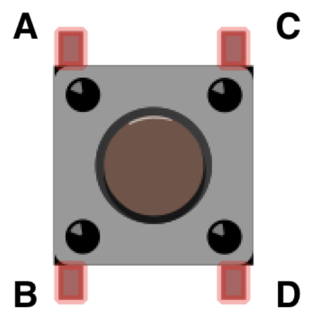

# Using the New Desks

These are the files for the NEW Desks in the 1701 Building. This also includes files for the radio transmitters and recievers.

## Connecting arduino to the desks

Below is the 7-Pin DIN pinout that the desks use for connection (with pin 1 on the male end connecting to pin 7 on the female end if looking straight on at each).

  

Looking at the male end, pin 2 of the connector needs to connect to pin 5 on the arduino as an INPUT_PULLUP in order to read button presses from the UP button. Pin 2 of the male connector needs to connect to pin 4 on the arduino as an INPUT_PULLUP in order to read button presses from the DOWN button. Pin 1 of the male connector must connect to GND.

Looking at the female end, pin 6 of the connector needs to connect to pin 3 on the arduino as an OUTPUT pin which is set to HIGH in order to move the desk UP. Pin 5 of the female connector needs to connect to pin 2 as an OUTPUT pin, which is also set to HIGH in order to move the desk DOWN. Both of these pins MUST be set to LOW to STOP the desk. Also, pin 4 of the female connector must connect to GND on the arduino.

## Connecting Ultrasonic Distance Measuring Sensor to Arduino

The Ultrasonic sensor has 4 pins: VCC, GND, Trigger, and Echo. VCC must be connected to the 5V pin on the Arduino, and GND must be connected to the GND pin. The Trigger pin is connected to pin 7 on the arduino, and the echo pin is connected to pin 6 on the arduino. These pins are used with the getDistance function in the code in order to calculate distance in cm. 

## Connecting Thermal Temperature Sensor (MLX90614)

The thermal sensor utilizes I2C communication. The sensor has 4 pins, VCC, GND, SDA and SCL. VCC must be connected to the 5V pin on the arduino, and GND must be connected to the arduino GND. The SDA pin must connect to the SDA pin on the arduino (pin A4) and the SCL pin must connect to the SCL pin on the arduino (pin A5). Using the <wire.h> library and the <Adafruit_MLX90614.h> library in Arduino, you can read the ambient temperature as well as the object temperature, and compare them.

# Remote Controlled Desk

The remote controlled desk uses an rf arduino with the new_desk_controlled_by_remote.ino file. Pins 9, 10, 11, 12, and 13 are all used for radio communication on both the desk, and the remote. Radio communication uses libraries <SPI.h>, <nRF24L01.h>, <RF24.h>, and <RF24Network.h> (see below).

## Connecting the Desk

The desk is connected the same was as shown above. There is no difference, except that the desk will be reading button presses from the remote.

## Connecting the Remote.

The remote has 3 buttons: UP, DOWN, and STOP. It is powered by a 9V battery (with + connected to the arduino VIN pin and - connected to GND). The pinout for the button is below:

  

To connect the button, connect pin A to the arduino digital pin, and pin D to GND. For UP, connect to D7 as INPUT_PULLUP. For DOWN, connect to D5 as INPUT_PULLUP. For STOP, connect to D3 as INPUT_PULLUP. The remote is as seen below:

  

# Radio Communication

The link for information on the rf nano is [here](https://github.com/keywish/keywish-nano-plus/tree/master/RF-Nano "RF-Nano Information"). The radios are used for the remote controlled desk (see above) as well as for the desk logger. The file INSERT FILE NAME FOR RECIEVER is the arduino code for the base/master, the [file radio_transmitter_node0X.ino](/radio_transmitter_node0X.ino "Radio Transmitter 0X File") is for any radio node in the network within the chain (aka is recieves data from one radio and sends data to another node). The file [radio_transmitter_node0XX.ino](/radio_transmitter_node0XX.ino "Radio Transmitter 0XX File") is for the last node in a network on a chain (aka it only sends data to another node). 

The link for information on how to build a network is seen at this [link](https://howtomechatronics.com/tutorials/arduino/how-to-build-an-arduino-wireless-network-with-multiple-nrf24l01-modules/ "RF-Nano Radio Communication Information"). Radio communication uses libraries <SPI.h>, <nRF24L01.h>, <RF24.h>, and <RF24Network.h>.

# References

## Arduino Nano Pinout

This pinout does NOT include the radio which uses pins 9-13. If using the radio/rf-nano, DO NOT USE THESE PINS. 

  

